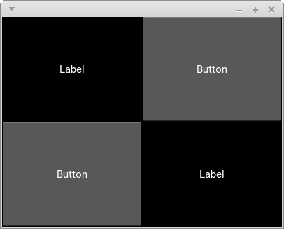
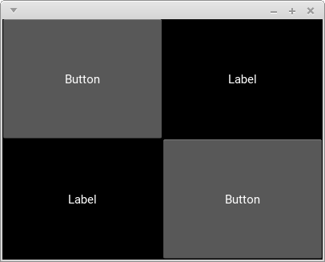
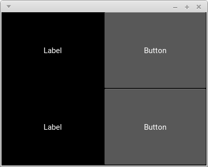
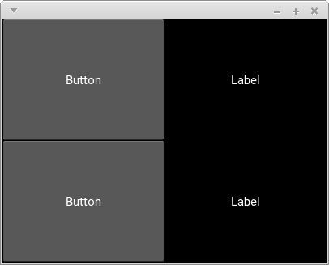

Kindle本「[KivyにKivyったけ #1: \_\_init\_\_()内でwidgetのidが使えない事があるのは何故?](https://www.amazon.co.jp/Kivy%E3%81%ABKivy%E3%81%A3%E3%81%9F%E3%81%91-1-__init__-%E5%86%85%E3%81%A7widget%E3%81%AEid%E3%81%8C%E4%BD%BF%E3%81%88%E3%81%AA%E3%81%84%E4%BA%8B%E3%81%8C%E3%81%82%E3%82%8B%E3%81%AE%E3%81%AF%E4%BD%95%E6%95%85-%E6%B0%B4%E6%88%B8%E3%81%86%E7%B4%8D%E8%B1%86%E9%BD%8B-ebook/dp/B07KMN9NBR)」の巻末に載っているQuizの解説です。

# 再掲

次のコードの実行結果はどれ？

```python
from kivy.config import Config
Config.set('graphics', 'width', 400)
Config.set('graphics', 'height', 300)
from kivy.app import runTouchApp
from kivy.factory import Factory
from kivy.lang import Builder

Builder.load_string('''
<MyWidget>:
    Label:
        text: 'Label'
''')

class MyWidget(Factory.BoxLayout):
    def __init__(self, **kwargs):
        super().__init__(**kwargs)  # C
        self.add_widget(Factory.Button(text='Button'))  # D

root = Factory.BoxLayout(orientation='vertical')
root.add_widget(MyWidget())  # A
root.add_widget(Builder.load_string('''
RelativeLayout:
    MyWidget:
'''))  # B

runTouchApp(root)
```

#### A



#### B



#### C



#### D




# 解説

まず`MyWidget`のinstanceはA行とB行の二箇所で作られています。ここでA行で作られているinstanceを`a`、B行で作られているinstanceを`b`と呼ぶことにします。

`a`はKv言語上では他のwidgetの子になっていないので「非遅延型の初期化」がなされます。なので`a`は`Kv rule`が適用された後にButtonが追加(D行)され、その結果 **左側にLabel** を **右側にButton** を持つBoxLayoutになります。

逆に`b`はKv言語上で他のwidgetの子になっているので「遅延型の初期化」がなされます。なので`b`はButtonが追加(D行)された後に`Kv rule`が適用され、結果 **左側にButton** を **右側にLabel** を持つBoxLayoutになります。

よって答えはAです。
